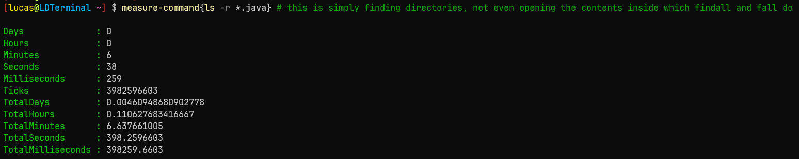

# Findall

Golang tool using fastwalk to recursively search through the working directory for an occurance of a string. File extension needs to be explicitly included

## Usage
```findall go fmt```
Will recursively find all .go files, search through each gofile for an occurance of "fmt" within the file. Extremely good for searching for variable occurances in a directory.

## Installation
To use this program, you can either download the binary in the bin directory, or build the file via
```go build findall.go```

## Speed

Leveraging fastwalk, this program is competitive with fd, and faster than powershell's ```ls -r```

## More serious usage

If you're overwhelmed by a massive amount of files, and would like to scan your own computer of any vulnerable words such as password, seed, privkey, etc, this program would be one of your only chances to do such without wrapping fd. ```findall txt password``` in root directory can scan your entire computer for password related text inside a file, allowing you to find any bad security practices in around a minute. You'd be surprised with what this <100 loc tool can find on your computer.

## Benchmarks

When executing short searches, an fd (recursive parallel file finder) wrapper that I created can win by a few seconds. When searching more common files, which are larger in size, findall will win by a significant amount. This is because findall closes a the file once a match has been made. The "fall" command is the fd wrapper using grep, the findall is my tool.


As you can see, findall beats fall by 2x.

fd is the number one competitor to this tool, as the native ```ls -r``` command cannot traverse directories recursively in a reasonable amount of time


6 minutes to find all .java files, in comparison to findall finding all java files containing a string in 6 seconds
